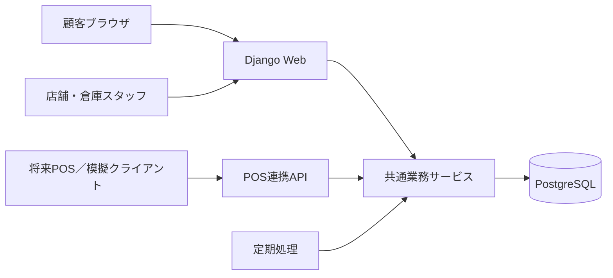

# GU学習用Webアプリ 設計仕様書

- 版：0.1（実装に向けた設計初稿）
- 作成日：2026-09-08
- 対応文書：要件定義書.md v0.1
- 本書の技術構成・未確認の細部は設計提案。今回アプリ実装は行わない。

## 1. 構成

Python／Djangoを中心に、Djangoテンプレートで顧客・スタッフ画面を提供し、PostgreSQLに業務データを保存する。複雑なフロントエンド分離は初回には行わない。採用バージョンは実装開始時にサポート状況と依存関係を確認して固定する。



業務サービスを画面、管理画面、POS連携で共通利用する。在庫変更をDjango管理画面の自由な数値編集に任せない。通知配信と期限処理はmanagement commandを1分間隔で実行する設計とし、この文書作成では定期実行を設定しない。

## 2. アプリ分割

| モジュール | 役割 |
|---|---|
| accounts | Django認証、顧客、スタッフ拠点所属 |
| catalog | 商品・SKU・店舗・倉庫・近隣順序 |
| inventory | 在庫、確保、在庫変更履歴、在庫調整 |
| orders | ORDER & PICK、取り寄せ注文、模擬決済、受渡し |
| transfers | 供給元選定、出荷、輸送中、入荷、事故対応 |
| notifications | 再入荷登録、イベント、アプリ内通知 |
| integrations | 将来POS受信契約、重複防止、模擬テスト |

## 3. 画面仕様

| ID | 画面 | 入力・表示・操作 |
|---|---|---|
| C01 | 商品一覧 | 商品名検索、商品へのリンク |
| C02 | 商品詳細 | 商品、価格、色・サイズ選択。未選択時は注文不可 |
| C03 | 店舗在庫 | 店舗別区分、在庫更新時刻、受取店舗選択、注文・取り寄せ・通知登録 |
| C04 | ログイン／登録 | メールとパスワード。ログイン後に元の商品へ戻る |
| C05 | 注文確認 | SKU、1点、税込金額、受取店舗、種別、模擬決済結果の選択 |
| C06 | 注文一覧・詳細 | 状態、受付日時、受取期限、許可時のみ取消し、受取コード |
| C07 | 通知・登録一覧 | 未読／既読、商品・店舗リンク、登録解除 |
| S01 | 業務一覧 | 自拠点の準備待ち・出荷待ち・入荷待ち・受渡し待ち |
| S02 | 注文業務詳細 | 現物確認、準備完了、出荷、入荷、受渡し、欠品報告。状態と所属で操作制限 |
| S03 | 在庫確認・調整 | 記録在庫、確保、履歴。管理者のみ理由付き調整 |
| A01 | マスタ管理 | 商品・SKU・拠点、近隣最大3店と優先順、スタッフ所属 |

画面遷移はC01→C02→C03→C05→C06。ログインが必要な操作はC04を挟む。再入荷通知はC07→C02/C03、スタッフはS01→S02。

文言例：「在庫情報は商品確保を保証するものではありません」「受取可能の通知が届いてからご来店ください」「再び注文可能になりました。通知時点で商品は確保されていません」。

## 4. データ設計

IDは内部主キー、外部公開する注文IDは推測されにくいUUID。日時はUTC保存・日本時間表示。金額は整数円とし、浮動小数点を使わない。履歴に関係する商品・拠点は物理削除を制限し、無効化する。

| エンティティ | 主な項目 | 制約 |
|---|---|---|
| User | id, email, password_hash, role | email一意、Django認証利用 |
| StaffLocation | user_id, location_id | 組み合わせ一意 |
| Product | id, name, description, image, active | 無効商品は新規注文不可 |
| SKU | id, product_id, color, size, barcode, price_yen, active | 商品・色・サイズ一意、barcode一意 |
| Location | id, name, type, active | type=STORE/WAREHOUSE |
| NearbyStore | receiver_id, source_id, priority | 受取元・供給元一意、受取元・順位一意、順位1〜3、双方店舗、自己参照不可 |
| Inventory | id, location_id, sku_id, on_hand, reserved, safety_stock, status, version, updated_at | 拠点・SKU一意、0≤reserved≤on_hand、safety_stock≥0 |
| Order | id, user_id, type, receiver_id, status, payment_status, total_yen, ready_at, expires_at, pickup_code_hash, created_at | type=PICKUP/TRANSFER |
| OrderLine | id, order_id, sku_id, quantity, unit_price_yen, sku_snapshot | 今回は注文あたり1明細、quantity=1 |
| Reservation | id, order_line_id, inventory_id, quantity, status | ACTIVE/RELEASED/CONSUMED/MOVED。明細あたりACTIVEは最大1件 |
| Transfer | id, order_id, source_id, receiver_id, sku_id, quantity, status, shipped_at, arrived_at | 注文あたり1件、数量1。供給元≠受取元 |
| InventoryMovement | id, inventory_id, delta_on_hand, delta_reserved, reason, order_id, transfer_id, event_key, actor_id, occurred_at | event_keyとinventory_idの組み合わせ一意。追記のみ |
| StockSubscription | id, user_id, inventory_id, status, created_at, notified_at | ACTIVEは顧客・在庫あたり最大1件 |
| StockEvent | id, inventory_id, version, occurred_at, processed_at | 在庫・version一意、注文可能数0→正数で作成 |
| StockEventRecipient | event_id, subscription_id | 組み合わせ一意、イベント発生時の対象登録を固定 |
| Notification | id, user_id, kind, source_key, message, link, created_at, read_at | user_id・source_key一意 |
| PaymentLog | id, order_id, kind, amount_yen, status, operation_key | 模擬CHARGE/REFUND、operation_key一意 |
| OperationKey | actor_id, key, request_hash, result_ref | actor_id・key一意。内容違いの同一キーは拒否 |
| IntegrationEvent | client_id, event_id, payload_hash, result, received_at | client_id・event_id一意 |
| AuditLog | id, actor_id, action, target_id, before_state, after_state, reason, at | 追記のみ |

在庫行はマスタ登録時に事前作成する。業務更新とMovementを同時保存する。破損品は販売対象在庫から除き、事故・調整履歴に数量と理由を残す。輸送中数量はTransferの状態と数量から集計し、Inventoryには含めない。

## 5. 在庫計算・排他制御

```text
free = on_hand - reserved
web_available = max(free - safety_stock, 0)
表示：free <= 1 → 在庫なし、free <= 3 → 残りわずか、それ以上 → 在庫あり
ただし在庫行または拠点が停止・不明なら確認不可として注文を拒否
```

表示の境界値は初期安全在庫1のルールである。将来設定変更する場合は表示境界値も併せて要件変更する。

在庫・注文・確保・模擬決済・履歴を`transaction.atomic()`でまとめ、更新対象を`select_for_update()`でロックしてから再判定する。SQLiteでは同等の在庫排他検証をしない。ロック中に外部通信を行わない。

既存注文の操作は「注文→関連在庫ID昇順→確保→通知登録」の順でロックする。新規注文では新規注文行の作成後に候補在庫をID順でロックし、選定は倉庫・近隣順位順で行う。在庫差異調整で複数注文を変更する際も、対象注文ID昇順を先にロックしてから在庫をロックし、対象が変わっていれば再試行する。短い競合エラーは上限付き再試行を行う提案とする。

| 業務 | on_hand | reserved | 備考 |
|---|---|---|---|
| 新規注文確保 | 変更なし | +1 | web_available≥1を確認 |
| 出荷前取消し | 変更なし | -1 | ACTIVE確保をRELEASEDへ |
| 店舗受渡し | -1 | -1 | ACTIVE確保をCONSUMEDへ |
| 取り寄せ出荷 | 供給元-1 | 供給元-1 | 元確保をMOVED、TransferをIN_TRANSITへ |
| 取り寄せ入荷 | 受取店+1 | 受取店+1 | 受取店にACTIVE確保を作成。一般在庫を増やさない |
| 入荷後期限切れ | 変更なし | 受取店-1 | 受取店に現物を残す |
| 通常補充 | +数量 | 変更なし | 管理者の理由付き操作 |
| 将来POS通常販売 | -数量 | 変更なし | 未確保数≥数量。Web用安全在庫は実店舗販売に適用しない |

POSで最後の1点を販売できても、注文確保分は売れない。安全在庫はWebでの過大な案内を抑えるための値である。

## 6. 注文状態と操作

### 6.1 ORDER & PICK

```text
注文成功 → PREPARING → READY → COMPLETED
PREPARING / READY → CANCELLED（顧客取消し）
PREPARING → CANCELLED（現物欠品）
READY → EXPIRED（受取期限切れ）
```

READYへの遷移時に現物取り分け確認、ready_at、expires_atを1回だけ設定する。再操作で期限を延長しない。

### 6.2 店舗お取り寄せ

```text
注文成功 → AWAITING_SHIPMENT → IN_TRANSIT → READY → COMPLETED
AWAITING_SHIPMENT → CANCELLED（顧客取消し／供給元欠品）
READY → EXPIRED（受取期限切れ）
IN_TRANSIT → CANCELLED（管理者の紛失・破損処理）
READY → CANCELLED（管理者の現物欠品・破損処理）
```

Transfer状態はRESERVED→IN_TRANSIT→ARRIVED、出荷前取消しはCANCELLED、輸送事故はLOST/DAMAGED。OrderとTransferは同一トランザクションで同期する。入荷操作には現物検品・取り分けを含め、同時にREADYにする。

輸送事故では輸送中数量を事故状態に移し、供給元・受取店の販売可能数を増やさない。READY後の破損では確保解除と現物在庫減算を同時に実施する。

### 6.3 決済・期限

模擬決済成功は注文確保と同時にPAID。取消し・期限切れはREFUNDEDとし、返金履歴を一度だけ作る。実決済の非同期失敗は今回対象外。将来導入時は決済待ち確保の有効期限、Webhook、返金再試行を追加設計する。

expires_atは「ready_atの日本時間の日付＋8日の00:00」。`now < expires_at`の場合のみ受取可能。期限処理はREADYかつ`expires_at <= now`を対象とする。顧客取消しと期限処理が競合した場合は注文ロックで直列化し、終端状態では副作用を再実行しない。

## 7. 主要処理

### 7.1 注文

1. ログイン、入力SKU・受取店舗、操作キーを検証する。
2. PICKUPは受取店舗、TRANSFERは有効倉庫と事前登録近隣店を候補にする。候補に受取店を入れない。
3. atomic内で候補在庫をロックし、在庫停止状態とweb_availableを再確認する。
4. 候補順で供給元を1拠点選び、模擬決済成功なら注文・明細・確保・決済履歴を一括作成する。
5. どの候補にも在庫がなければ409相当の業務エラーを返す。失敗時に一部確保を残さない。
6. 受付通知を保存する。受付段階で来店を促す文言を出さない。

### 7.2 再入荷通知

在庫更新の前後でweb_availableを比較する。0→正数なら同一トランザクションでStockEventと、その瞬間にACTIVEの登録一覧をStockEventRecipientへ保存する。登録作成も同じ在庫行をロックして在庫なし条件を検証し、登録と入荷の競合による通知漏れを防ぐ。

定期処理は未処理イベントから、まだACTIVEである対象登録をロックしてNotificationを作り、登録をNOTIFIEDにする。通知・登録更新・イベント処理完了をatomicで保存する。解除済み登録はスキップ。同じイベントの再処理では一意制約により重複通知しない。複数イベントに同じ登録が含まれても、登録ロックと状態判定で通知は1回。

イベント後に売り切れていても「イベント発生時点で注文可能になった」通知であることを時刻付きで示し、現在在庫は遷移先で再照会する。今回の規模ではDB内の通知保存で完結する。

### 7.3 現物不足

スタッフは不足を報告し、対象在庫をBLOCKEDにして新規Web注文を止める。管理者は再確認した現物数と不足対象の注文を確認する。必要な注文取消し・確保解除・返金を行い、reserved≤on_handを満たす状態で実数へ調整する。一連の変更と理由を同時保存する。対象注文が不足する場合は調整を拒否し、BLOCKEDを維持する。

単に欠品注文の確保を解除して誤った在庫数を販売可能に戻してはならない。BLOCKED中は再入荷通知を発生させず、復旧時に「利用不可→注文可能」の遷移として評価する。

## 8. URLと入出力

初回はDjangoのHTMLビュー・フォームを基本とし、以下はHTTP操作の契約を示す。JSON APIの全面実装は不要。GETで業務状態を変更しない。

| 方法・URL | 入力 | 結果・権限 |
|---|---|---|
| GET /products/ | q | 商品一覧 |
| GET /products/{id}/ | sku | 商品詳細 |
| GET /inventory/ | sku_id | 店舗・区分・updated_at。顧客には内部確保数を返さない |
| POST /subscriptions/ | sku_id, store_id | 登録、顧客のみ |
| POST /subscriptions/{id}/cancel/ | なし | 所有者のみ解除 |
| POST /orders/ | sku_id, receiver_id, type, mock_payment_result, operation_key | 注文IDまたは在庫不足 |
| GET /orders/{uuid}/ | なし | 所有者または関係拠点スタッフ |
| POST /orders/{uuid}/cancel/ | operation_key | 許可状態なら取消し |
| POST /staff/orders/{uuid}/ready/ | operation_key | PICKUPの現物確認済み準備完了 |
| POST /staff/orders/{uuid}/ship/ | operation_key | TRANSFERの供給元のみ |
| POST /staff/orders/{uuid}/receive/ | operation_key | TRANSFERの受取店のみ、検品確認 |
| POST /staff/orders/{uuid}/complete/ | pickup_code, operation_key | 受取店のみ、READYかつ期限内 |
| POST /staff/inventory/{id}/report-shortage/ | reason | 自拠点のみ注文停止・不足報告 |
| POST /admin/inventory/{id}/adjust/ | counted_quantity, affected_order_ids, reason, operation_key | 管理者のみ、不変条件検証 |

不正入力は400、未認証はログイン誘導（APIは401）、権限不足は403、他人の顧客データは404、在庫競合・状態不整合は409相当で説明する。HTMLでは入力内容を保持して再表示する。模擬決済は学習用であることを画面に明示する。

受取コードは十分なランダム値を発行しハッシュ保存する。顧客への表示用原文は暗号化保存する提案とし、鍵は環境変数で管理する。試行回数を制限し、受取コードだけでは他人の注文内容を取得できない。

## 9. 将来POS連携仕様

`POST /integrations/pos/sales/`。拠点に紐づいた専用資格情報を使い、ブラウザ顧客認証と分離する。

```json
{
  "event_id": "pos-001-sale-123-line-1",
  "transaction_id": "sale-123",
  "line_id": "1",
  "store_id": "store-a",
  "sku_id": "sku-blue-m",
  "quantity": 1,
  "occurred_at": "2026-09-08T10:00:00+09:00"
}
```

同じclient_id・event_idかつ同じ内容は元の成功結果を返し、内容が異なれば409。同じ取引明細を別event_idで送る重複も防ぐため、client_id・transaction_id・line_idに販売一意制約を追加する。通常販売は中央在庫の未確保数で可否を判定し、確定後にPOSが販売成功を表示する同期方式を前提とする。

POSが独立して売上確定した後の事後連携やオフライン販売では、Web確保を保証できないため初回契約の対象外。中央サービスに接続できない場合は模擬POS販売を確定しない。

Web注文の店舗受取は通常販売APIに流さず、注文IDを指定する受渡しサービスへ接続する。将来POSでも同じ受渡しサービスを呼び、COMPLETED再送では在庫・売上を再計上しない。返品は販売履歴への参照と重複防止が必要なため別途設計する。

## 10. 検証計画

要件定義書AC01〜AC13を受入テストとして実装する。特にDBロックのテストはPostgreSQL上で独立トランザクション／接続を使い、実際に同時実行する。

- 単体：在庫境界、期限の日本時間日付計算、状態遷移、候補順位。
- 結合：注文→準備→受取、取り寄せ→出荷→入荷→期限切れ、通知登録→入荷→通知。
- 競合：同時注文、取消しと出荷、受取と期限切れ、入荷と通知登録、POS販売とWeb注文。
- 障害：途中例外で全変更ロールバック、イベント再実行、二重クリック、輸送事故、現物不足。
- 権限：他人の注文ID、他店舗スタッフ、未認証、CSRF。
- 運用：初期データ投入、バックアップ復元、375px画面、主要応答時間。

初期データは店舗A/B/C/D・倉庫W、商品例と色サイズを用意し、在庫0・1・2・3・4点のSKUを含める。Aの近隣店はB/C/Dとし、倉庫欠品、第一候補欠品、全候補欠品も再現可能にする。

## 11. AI駆動開発への引き継ぎ

各実装依頼に「対応FR/AC」「変更対象」「不変条件」「対象外」「確認方法」を添える。最初に在庫サービスと競合検証を固め、その後に画面を接続する。AI生成コードの動作確認を人が行い、実装済みと未実装を記録する。

完了基準は画面の見た目だけでなく、受入条件が通ること、権限外操作が拒否されること、DB移行と初期データで再構築できることとする。実決済・物流等をAIの判断だけで追加しない。

## 12. 未決事項と参照

Django構成、1注文1点、倉庫優先、通知1回、公開先・保持期間は要件定義書の提案・確認事項を参照。公開URLや実サービス資格情報は現時点では存在しない。GU公式サービスとの互換性や正式な業務ルールを本設計から推定しない。

技術上の根拠：Djangoのトランザクションで一連の更新をまとめ、行ロックで同時更新を直列化する。ロック対象と状態判定はアプリ側で明示する。

- [Django公式：Database transactions](https://docs.djangoproject.com/en/5.2/topics/db/transactions/)
- [Django公式：select_for_update](https://docs.djangoproject.com/en/5.2/ref/models/querysets/#select-for-update)

上記は仕組みを確認する参照であり、Django 5.2の採用を確定するものではない。
